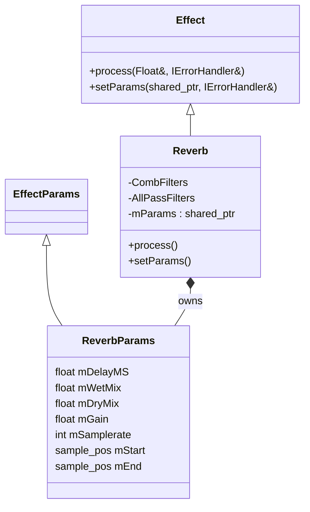

# 🏛️ Architecture Overview

`AJ-Audio-Engine` is an **offline audio processing engine** designed for audio editors and tooling applications. It provides a modular and extensible framework for loading, saving, and processing audio data using various DSP effects with full support for undo and custom error handling.

This document outlines the **overall system architecture**, its **components**, **library dependencies**, and the **flow of audio data** throughout the engine.

---

## 📦 Major Components

```
AJ-Audio-Engine
│
├── 🎛️ DSP Effects
│   ├── Echo, Reverb, Gain, etc.
│   └── Each has its own parameters and processing logic
│
├── 🎚️ Audio Functionality
│   ├── Channel-based audio buffers
│   ├── Float-based internal representation
│   └── Offline processing (no real-time threading yet)
│
├── 📁 File I/O (WAV/MP3)
│   ├── WAV_File (libsndfile)
│   ├── MP3_File (FFmpeg)
│   └── Float planar decoded format for all files
│
├── 🔁 Undo System
│   ├── Supports multi-step undo (not implemented yet)
│   └── Stores deep copies of audio states
│
├── 🧠 AJ_Engine (API Layer)
│   ├── loadAudio() / saveAudio()
│   ├── applyEffect(buffer/file/list)
│   └── Undo + error handling integration
│
└── 🔊 Audio I/O (Planned)
    ├── Audio Playback
    └── Audio Recording
```

---

## 🔧 External Libraries Used

| Library                          | Purpose                                                |
| -------------------------------- | ------------------------------------------------------ |
| **libsndfile**                   | Reading/writing `.wav` files                           |
| **FFmpeg**                       | Reading/writing `.mp3`, resampling                     |
| *(Planned)* PortAudio or RtAudio | Audio playback and recording (cross-platform C++ APIs) |

---

## 🔁 Audio Processing Flow

```mermaid
flowchart LR
    A[🔊 Input Audio File (MP3/WAV)] --> B[📁 File I/O Layer]
    B --> C{File Format?}
    C -->|MP3| D1[FFmpeg Decoder]
    C -->|WAV| D2[libsndfile Reader]
    
    D1 --> E[🔗 AudioFile Interface (Decoded to float planar)]
    D2 --> E

    E --> F[🧠 AJ_Engine API]
    F --> G[🎛️ applyEffect() API]
    G --> H[🧠 DSP Effect Processor]
    H --> I[🔁 Undo System (if enabled)]
    I --> J[📁 saveAudio()]
    J --> K[🔊 Output File (MP3/WAV)]
```

### 🎯 Flow Highlights

* Input files are loaded via `loadAudio()` and decoded into **float planar buffers**
* Processing is **offline** (no real-time threads or hardware latency)
* Effects are applied **per-channel** using a strategy-like interface (`Effect` base class)
* Changes can be saved via `saveAudio()` or reverted with the undo system

---

## 🧠 DSP Architecture Summary

* Each effect inherits from `Effect` interface
* Takes `EffectParams` subclass (e.g., `ReverbParams`, `EchoParams`, etc.)
* Processing is done *in-place* on `Float` buffers
* All processing is done in **32-bit float** precision for maximum accuracy




Let me know if you want to visualize filters (`CombFilter`, `AllPassFilter`) too.


---

## 🧠 AJ\_Engine Role

The `AJ_Engine` is the central controller that exposes user-level APIs:

* `applyEffect(buffer, effect, params)`
* `applyEffect(file, effect, params)`
* `applyEffect(list, effect, params)`
* `loadAudio(path)`
* `saveAudio(audio)`

Error handling is built-in but can be customized.

Undo functionality is built-in and **enabled by default**, but it can be **disabled** when not needed.

📁 Location:

* `include/core/aj_audio_engine.h`
* `src/core/aj_audio_engine.cc`

📌 Example usage: `src/main.cc`

```cpp
auto engine = AJ::AJ_Engine::create();
auto audio = engine->loadAudio("/path/audio.wav", handler);

auto params = std::make_shared<AJ::dsp::reverb::ReverbParams>();
params->mStart = 0;
params->mEnd = audio->mInfo.length;
params->mSamplerate = audio->mInfo.samplerate;

engine->applyEffect(audio->pAudio->at(0), AJ::Effect::reverb, params, handler);
engine->saveAudio(audio, handler);
```

---

## 🎚️ Supported Effects

```cpp
enum Effect {
    Distortion,     // Adds harmonic saturation or clipping
    echo,           // Adds delay-based repetitions
    reverb,         // Simulates space/room reflections
    fadeIn,         // Gradually increases volume from 0 to full
    fadeOut,        // Gradually decreases volume from full to 0
    gain,           // Amplifies or attenuates audio
    normalization,  // Normalizes signal to target level
    pitchShift,     // Alters pitch without changing speed
    reverse         // Plays audio in reverse (backwards)
};
```

> You can easily extend the engine by adding a new effect class implementing `Effect`, and using the existing `applyEffect()` API.

---

## 🔋 Design Principles

✅ **Modularity** – Clean separation between DSP, File I/O, Engine, and Undo.
✅ **Extendability** – Add new file formats, effects, or interfaces easily.
✅ **Portability** – No platform-specific code in the core engine.
✅ **Offline Processing** – All operations are designed to be done **non-real-time**.

---
