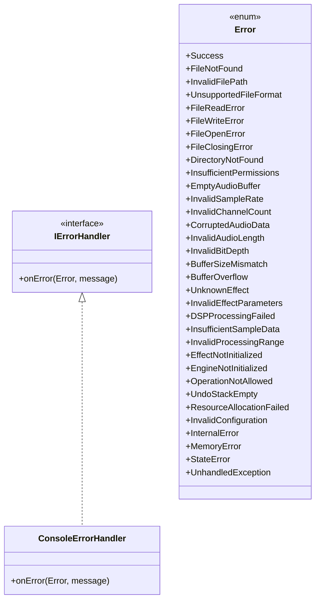

# 🛠️ Error Handling

AJ-Engine uses a flexible **Strategy Pattern** for error handling, allowing the user to plug in custom behavior for how errors are reported or handled throughout the engine. A default handler is provided for convenience, but applications are encouraged to define their own logic depending on context (CLI, GUI, logging system, etc.).

---

## ⚙️ Interface: `IErrorHandler`

The `IErrorHandler` interface defines the contract for handling errors:

```cpp
class IErrorHandler {
public:
    virtual void onError(Error err, const std::string &errorMessage) = 0;
    virtual ~IErrorHandler() = default;
};
```

Any class implementing this interface can be injected into engine components to override how errors are processed.

---

## 🖥️ Built-in: `ConsoleErrorHandler`

A default implementation is provided as `ConsoleErrorHandler`. It prints color-coded errors to the terminal depending on their category:

```cpp
ConsoleErrorHandler handler;
const std::string message = "Could not locate input.wav";
handler.onError(AJ::error::Error::FileNotFound, message);
```

### Output Example:

```text
[AJ-Engine Error] [File] Could not locate input.wav (Error Code: 100)
```

---

## 🚦 Error Code System

All error conditions in the engine are categorized and encoded via a centralized enum: `AJ::error::Error`.

### Categories:

| Code Range | Category             | Example Errors                           |
| ---------- | -------------------- | ---------------------------------------- |
| 100–199    | File System Errors   | `FileNotFound`, `InvalidFilePath`        |
| 200–299    | Audio Errors         | `EmptyAudioBuffer`, `InvalidBitDepth`    |
| 300–399    | DSP/Effect Errors    | `UnknownEffect`, `DSPProcessingFailed`   |
| 400–499    | Engine/System Errors | `EngineNotInitialized`, `UndoStackEmpty` |
| 500–599    | Internal Errors      | `InternalError`, `MemoryError`           |

These are defined in `include/core/errors.h`.

---

## 🧱 How to Use

You can implement your own handler:

```cpp
class MyLoggerHandler : public AJ::error::IErrorHandler {
public:
    void onError(AJ::error::Error err, const std::string &message) override {
        logToFile("[Error " + std::to_string((int)err) + "] " + message);
    }
};
```

And use it with any component:

```cpp
MyLoggerHandler myHandler;
audioFile.read(myHandler);
```

---

## 📐 Class Diagram (Mermaid)

You can paste this into a Markdown viewer that supports [Mermaid.js](https://mermaid.js.org/) to get a visual diagram of the error handling architecture.

````markdown

````

---

## 📁 File Locations

| Component             | Path                           |
| --------------------- | ------------------------------ |
| `IErrorHandler`       | `include/core/error_handler.h` |
| `ConsoleErrorHandler` | `include/core/error_handler.h` |
| `Error` Enum          | `include/core/errors.h`        |

---