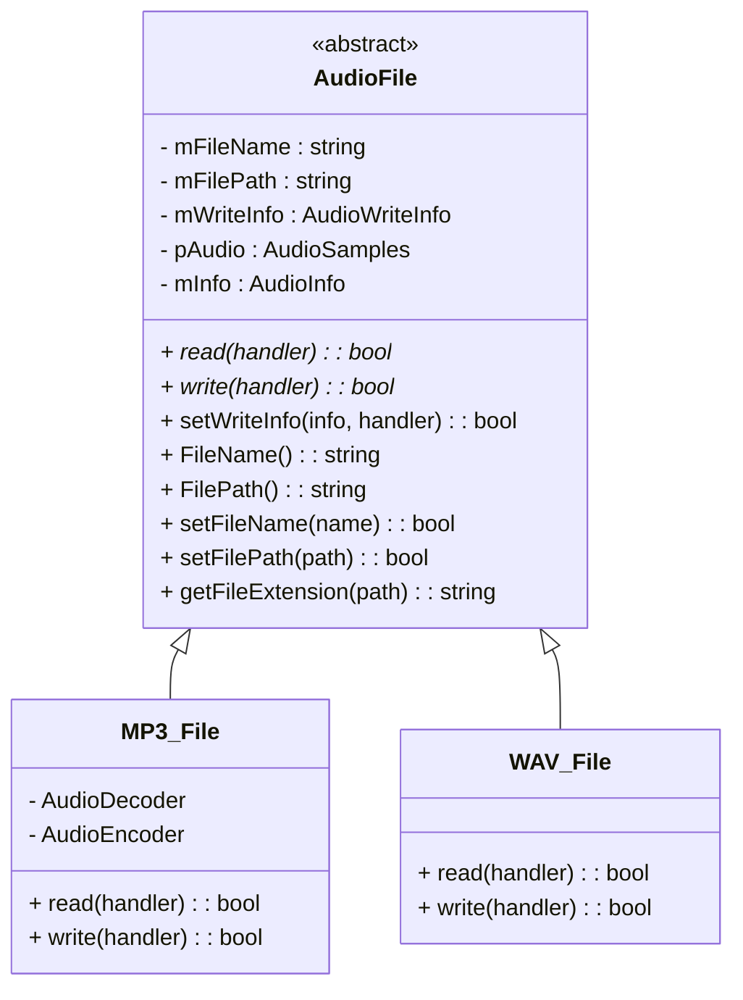

# 📁 File I/O

This module provides a unified interface for reading and writing audio files. It currently supports **WAV** and **MP3** formats based on the YAGNI principle.

## ✨ Supported Formats

| Format | Decoder/Encoder | Notes                                   |
| ------ | --------------- | --------------------------------------- |
| WAV    | libsndfile      | Full read/write + bit depth support     |
| MP3    | FFmpeg          | Read/write; no native bit depth support |

Resampling is **not yet implemented**, but will be added using the **FFmpeg resampler** for both formats.

---

## 🧩 Architecture Overview

At the heart of the File I/O system is the `AudioFile` abstract class. It defines a generic interface for audio file operations, such as reading and writing, and handles common metadata and validation logic.

Each specific format (like **WAV** or **MP3**) is implemented as a subclass of `AudioFile`:

* `WAV_File`: Uses **libsndfile** internally
* `MP3_File`: Uses **FFmpeg** for decoding/encoding

These subclasses override the `read()` and `write()` methods using their respective format-specific backends.

📌 **Decoded Sample Format**
Regardless of format, all audio files are decoded into **float planar** format — where:

* Each audio **channel** has its own `Float` buffer (e.g., stereo => 2 separate buffers)
* Each buffer contains **32-bit float samples** for high-precision processing

This format ensures:

* ✅ Compatibility with all DSP effects
* ✅ High accuracy and precision
* ✅ Ease of channel-wise parallel processing.

---

## 📦 Class Overview

### `AudioFile` (Abstract)

Responsible for:

* Common metadata storage (e.g., filename, path, sample rate).
* Path and file name validation.
* Defining the interface for reading and writing audio files (`read()` and `write()` are `virtual`).
* Managing shared audio buffers and info structs.

### `WAV_File`

Implements `read()` and `write()` using **libsndfile**.

* Handles lossless PCM audio.

### `MP3_File`

Implements `read()` and `write()` using **FFmpeg**.

* Handles compressed/lossy audio.

---

## 📊 Audio Metadata Structures

### `AudioInfo`

Describes metadata **read** from audio files.

```cpp
struct AudioInfo {
    sample_c length;
    sample_c samplerate;
    uint8_t channels;
    BitDepth_t bitdepth; // used by WAV_File only
    std::string format;
    bool seekable;
};
```

### `AudioWriteInfo`

Describes metadata needed for **writing** audio files.

```cpp
struct AudioWriteInfo {
    sample_c length;
    sample_c samplerate;
    uint8_t channels;
    BitDepth_t bitdepth; // used by WAV_File only
    std::string format;
    bool seekable;
    std::string path;
    std::string name;
};
```

---

## 📐 Class Diagram (Mermaid)

Here are the **class diagrams** based on your updated code for:

* `AudioFile` (abstract base class)
* `MP3_File` (inherits from `AudioFile`)
* `WAV_File` (inherits from `AudioFile`)

These diagrams show inheritance, key methods, internal structures, and relationships:

---

### 📦 `AudioFile` (abstract base class)

```
+-----------------------------------------------+
|                AJ::io::AudioFile              |
+-----------------------------------------------+
| - mFileName: std::string                      |
| - mFilePath: std::string                      |
| - mWriteInfo: AudioWriteInfo                  |
| - pAudio: AudioSamples                        |
| - mInfo: AudioInfo                            |
+-----------------------------------------------+
| + AudioFile()                                 |
| + ~AudioFile()                                |
| + read(handler): bool = 0                     | (pure virtual)
| + write(handler): bool = 0                    | (pure virtual)
| + setWriteInfo(info, handler): bool           |
| + FileName(): std::string                     |
| + FilePath(): std::string                     |
| + setFileName(name): bool                     |
| + setFilePath(path): bool                     |
| + getFileExtension(path): std::string         |
+-----------------------------------------------+
| # available_file_extension(ext): bool         |
| # validPath(path): bool                       |
| # validDirectory(path): bool                  |
| # trimFileName(name): bool                    |
+-----------------------------------------------+
```

---

### 📦 `MP3_File` (inherits from `AudioFile`)

```
+--------------------------------------------------+
|                  AJ::io::MP3_File                |
+--------------------------------------------------+
| - mDecoderInfo: AudioDecoder                     |
| - mEncoderInfo: AudioEncoder                     |
+--------------------------------------------------+
| + MP3_File()                                     |
| + read(handler): bool override                   |
| + write(handler): bool override                  |
+--------------------------------------------------+
| - openFile(handler): bool                        |
| - initDecoder(handler): bool                     |
| - decode(handler): bool                          |
| - setAudioInfo(ctx, total_samples): void         |
| - initEncoder(handler): bool                     |
| - allocateFrame(frame, size, handler): void      |
| - resampleFrameData(f, resampled, ctx, handler): |
| - writeData(handler): bool                       |
| - encode(handler): bool                          |
+--------------------------------------------------+
| struct AudioDecoder                              |
|   - stream_idx: int                              |
|   - format_ctx: AVFormatContext*                 |
|   - decoder_params: AVCodecParameters*           |
|   - decoder: const AVCodec*                      |
|   - decoder_ctx: AVCodecContext*                 |
|   - fifo: AVAudioFifo*                           |
|   - total_samples_per_chan: sample_c             |
|                                                  |
| struct AudioEncoder                              |
|   - encoder: const AVCodec*                      |
|   - encoder_ctx: AVCodecContext*                 |
|   - file: FILE*                                  |
|   - packet: AVPacket*                            |
+--------------------------------------------------+
```

---

### 📦 `WAV_File` (inherits from `AudioFile`)

```
+--------------------------------------------------+
|                  AJ::io::WAV_File                |
+--------------------------------------------------+
| + read(handler): bool override                   |
| + write(handler): bool override                  |
+--------------------------------------------------+
| - close_file(file, return_val, handler): bool    |
| - get_bit_depth(info): BitDepth_t                |
| - read_mono_data(file, handler): bool            |
| - read_stereo_data(file, handler): bool          |
| - set_file_info(info): void                      |
| - write_samples_mono(file, handler): bool        |
| - write_samples_stereo(file, handler): bool      |
+--------------------------------------------------+
```

---

### 🧭 Relationships



---

## 🛠 Future Work

* [ ] FFmpeg-based resampling support.
* [ ] Format auto-detection from headers.
* [ ] Streamed file reading (large files).
